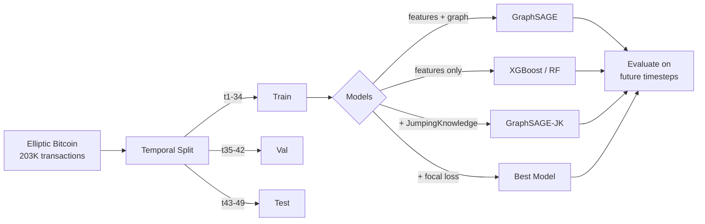

# Bitcoin Fraud Detection with Graph Neural Networks

## Motivation

I wanted to test a claim I kept seeing in papers: that GNNs outperform feature-based models for financial fraud detection. The Elliptic Bitcoin dataset has 203K transactions labeled as licit or illicit, connected by payment flows. The real test: does a GNN trained on past transactions generalize to future ones? Most published benchmarks use random splits, which leak future information into training. Temporal splits tell a very different story.

## Architecture



## Results

### Main comparison

| Model | Test ROC-AUC | Test PR-AUC | Notes |
|---|---|---|---|
| XGBoost (features only) | 0.520 | 0.026 | Essentially random on future data |
| Random Forest | 0.734 | 0.053 | Class balancing helps generalization |
| GraphSAGE (3 layers) | 0.761 | 0.052 | Graph structure adds temporal robustness |
| GraphSAGE-JK (3 layers) | 0.783 | 0.061 | JK preserves multi-scale neighborhood info |
| **GraphSAGE-JK + focal loss** | **0.800** | **0.073** | Focal loss handles extreme imbalance |

The gap between validation AUC (~0.94 for all GNNs) and test AUC (0.80 best) is the temporal distribution shift: fraud patterns at timesteps 43-49 differ from 1-34. XGBoost memorizes training-time patterns and collapses to random performance on future data. The GNN generalizes better because it propagates information through edges that connect test transactions to older parts of the graph.

### What each improvement adds

Starting from the base GraphSAGE (0.761):

- **JumpingKnowledge** (+0.022 AUC): Concatenates representations from all 3 GNN layers instead of using only the last. On a sparse graph (average degree 1.15), layer 1 sees immediate neighbors, layer 3 reaches 3 hops out. JK preserves both scales of signal.

- **Focal loss** (+0.017 AUC): Instead of just weighting the rare class higher, focal loss down-weights easy examples (confident predictions) and focuses on hard cases near the decision boundary. Better than weighted BCE when only 2.5% of test data is illicit.

### What I tried that didn't help

**Temporal encoding:** Adding learnable timestep embeddings to node features (0.736 AUC, slightly worse). The graph topology already encodes temporal proximity through directed payment edges.

**Self-supervised pre-training (GraphMAE):** Pre-training the encoder to reconstruct masked features on all 203K nodes. The reconstruction loss didn't converge -- the graph is too sparse for masked neighbors to provide enough reconstruction context, and 72 of the 165 features are pre-computed neighbor aggregates that create a circular dependency with message passing.

**Self-loops:** Adding self-loops nearly doubled the edge count (234K to 438K) and diluted the neighbor signal. Hurt performance.

**Undirected edges:** Adding reverse edges destroyed the directional signal of money flows. In Bitcoin, where funds come from and where they go are different signals.

**GAT:** Attention needs multiple neighbors to learn meaningful weights, but most nodes only have 1-2 connections. Underperformed GraphSAGE by 10+ points.

**Ensemble (GNN + XGBoost):** Since XGBoost gives near-random predictions (0.52 AUC) on the test set, averaging it with the GNN just drags performance down.

## Quick Start

```bash
python -m venv .venv && source .venv/bin/activate
pip install -r requirements.txt
make download   # requires kaggle API key
make train      # GraphSAGE-JK + focal loss (best config)
```

## Project Structure

```
src/
  data/         download, graph builder, temporal splits
  models/       GraphSAGE, GAT, GCN, JK variants, focal loss, temporal GNN, GraphMAE, XGBoost, RF
  evaluation/   metrics, ablation study, plots
  utils/        config, seed
configs/        experiment hyperparameters
tests/          data pipeline tests
```

## Technical Decisions

**Why temporal splits instead of random?** Random splits allow the model to see transactions from timestep 45 during training and predict timestep 44 during testing. This is unrealistic: in production, you only have past data. Temporal splits (train on t1-34, test on t43-49) reveal that XGBoost drops from 0.97 val AUC to 0.52 test AUC, while GNNs hold up at 0.80.

**Why GraphSAGE over GCN/GAT?** GraphSAGE's sampling-based aggregation handles the sparse, directed graph better than GCN's spectral normalization. GAT needs multiple neighbors to learn meaningful attention weights, but most nodes have only 1-2 connections.

**Why JumpingKnowledge?** The Elliptic graph is extremely sparse (234K directed edges for 203K nodes, average degree 1.15). With a standard 3-layer GNN, only the final layer's representation is used for classification, losing the local (1-hop) signal. JK concatenates all layers, preserving both local and extended neighborhood structure.

**Why focal loss over weighted BCE?** With only 169 illicit transactions in the test set (2.5%), weighted BCE upweights the rare class uniformly. Focal loss is smarter: it reduces the loss contribution from easy examples (obvious licit transactions) and focuses on the ambiguous cases near the decision boundary.

**Why keep unknown labels in the graph?** Only 23% of transactions have labels, but the unlabeled 77% still participate in message passing. Removing them would disconnect the graph further.

## Limitations

- PR-AUC is low across all models (~0.07 best). With only 169 illicit transactions in the test set, even the best model struggles with precision at reasonable recall thresholds. This reflects a real challenge in production fraud systems.
- The 165 features include 72 pre-computed neighbor aggregates from the original dataset, which partially overlap with what a GNN learns through message passing. On raw features, the GNN advantage would likely be larger.
- I only tested homogeneous GNN architectures. The Elliptic++ dataset extends this with wallet address nodes, creating a heterogeneous graph that could be modeled with type-specific message passing.
- No hyperparameter search beyond manual grid exploration. Bayesian optimization could squeeze out a few more points.
